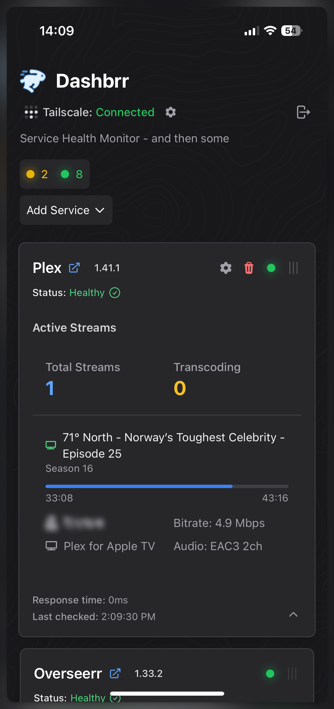

<h1 align="center">
  <br/>
  Dashbrr
</h1>

<p align="center">&nbsp;&nbsp;</p>

<p align="center">
A sleek, modern dashboard for monitoring and managing your media stack services.<br>
Dashbrr provides real-time monitoring, service health checks, and unified management for your entire media server ecosystem.
</p>

<p align="center">

</p>

## Table of Contents

- [Features](#features)
- [Supported Services](#supported-services)
- [Installation](#installation)
  - [Docker Installation](#docker-installation)
  - [Binary Installation](#binary-installation)
- [Configuration](#configuration)
  - [Configuration File](#configuration-file)
  - [Environment Variables](#environment-variables)
  - [Service Discovery](#service-discovery)
  - [Command Line Interface](#command-line-interface)
  - [Authentication](#authentication)
- [Tech Stack](#tech-stack)
- [Screenshots](#screenshots)

> [!WARNING]  
> Dashbrr is in early development. Expect bugs, and please report them ❤️

## Features

- Real-time service health monitoring
- Service-specific data display and management
- Cached data with live updates via SSE (Server-Sent Events)
- Flexible authentication options:
  - Built-in authentication system
  - OpenID Connect (OIDC) support
- Responsive and modern UI with draggable cards
- Docker support
- Multiple database support (SQLite & PostgreSQL)
- Flexible caching system (In-memory or Redis)
- Comprehensive CLI for service management and system operations
- Progressive Web App (PWA) support for mobile and desktop

## Supported Services

### Media Management

- **Plex**: Active streams monitoring, version check
- **Sonarr & Radarr**:
  - Comprehensive queue management:
    - Monitor active downloads
    - Stuck downloads detection and resolution
  - Error reporting for indexers and download clients
  - Version check and update notifications
- **Overseerr**: Request management, pending requests monitoring

### Download Management

- **Autobrr**: IRC network health, release statistics
- **Prowlarr**: Indexer health monitoring
- **Maintainerr**: Rule matching, scheduled deletion monitoring
- **Omegabrr**: Service health, manual ARR triggers

### Network

- **Tailscale**: Device status, information tracking, tag overview

## Installation

### Docker Installation

Several docker-compose configurations are available in the `docker-compose` directory:

```bash
# Using memory cache (default)
docker compose -f docker-compose/docker-compose.yml up -d

# Using Redis cache
docker compose -f docker-compose/docker-compose.redis.yml up -d

# Using service discovery features
docker compose -f docker-compose/docker-compose.discovery.yml up -d
```

All configurations use PostgreSQL as the database by default. If you want to use SQLite instead, uncomment the SQLite configuration lines and comment out the PostgreSQL ones in your chosen compose file. See example configurations in the respective files in the `docker-compose` directory.

Note: There is also a `docker-compose.integration.yml` file in the docker-compose directory which is used specifically for running integration tests via the `make test-integration` command. This file is not intended for regular deployment use.

### Binary Installation

#### Linux/macOS

Download the latest release:

```bash
wget $(curl -s https://api.github.com/repos/autobrr/dashbrr/releases/latest | grep download | grep linux_x86_64 | cut -d\" -f4)
```

#### Unpack

Run with `root` or `sudo`. If you do not have root, place the binary in your home directory (e.g., `~/.bin`).

```bash
tar -C /usr/local/bin -xzf dashbrr*.tar.gz
```

#### Systemd Service (Linux)

Create a systemd service file:

```bash
sudo nano /etc/systemd/system/dashbrr@.service
```

Add the following content:

```systemd
[Unit]
Description=dashbrr service for %i
After=syslog.target network-online.target

[Service]
Type=simple
User=%i
Group=%i
ExecStart=/usr/local/bin/dashbrr --config=/home/%i/.config/dashbrr/config.toml

[Install]
WantedBy=multi-user.target
```

Enable and start the service:

```bash
systemctl enable -q --now --user dashbrr@$USER
```

## Configuration

### Configuration File

Dashbrr uses a simple TOML configuration file. Default location: `./config.toml`

```toml
[server]
listen_addr = ":8080"

[database]
type = "sqlite"
path = "./data/dashbrr.db"
```

By default, the database file will be created in the same directory as your configuration file. For example:

- If your config is at `/home/user/.config/dashbrr/config.toml`, the database will be at `/home/user/.config/dashbrr/data/dashbrr.db`
- If your config is at `/etc/dashbrr/config.toml`, the database will be at `/etc/dashbrr/data/dashbrr.db`

You can override this behavior by using the `-db` flag to specify a different database location:

```bash
dashbrr -config=/etc/dashbrr/config.toml -db=/var/lib/dashbrr/dashbrr.db
```

### Environment Variables

For a complete list of available environment variables and their configurations, see our [Environment Variables Documentation](docs/env_vars.md).

Key configuration options include:

- Server settings (listen address, ports)
- Cache configuration (Memory/Redis)
- Database settings (SQLite/PostgreSQL)
- Authentication (Built-in/OIDC)

### Service Discovery

Dashbrr supports automatic service discovery and configuration through Docker labels, Kubernetes labels, and external configuration files. For detailed information about service discovery and configuration management, see our [Service Discovery Documentation](docs/config_management.md).

Key features include:

- Docker container label-based discovery
- Kubernetes service label-based discovery
- YAML/JSON configuration file import/export
- Environment variable substitution for API keys
- Secure configuration management

### Command Line Interface

Dashbrr provides a CLI for managing services, user, and system operations. For detailed information about available commands and their usage, see our [Command Line Interface Documentation](docs/commands.md).

Key features include:

- Service management (add, remove, list)
- User management
- Health checks
- Version information

### Authentication

Dashbrr offers two authentication methods:

#### Built-in Authentication (Default)

Simple username/password authentication with user management through the application.


#### OpenID Connect (OIDC)

Enterprise-grade authentication with support for providers like Auth0.


Required OIDC environment variables:

```bash
OIDC_ISSUER=https://your-provider.com
OIDC_CLIENT_ID=your-client-id
OIDC_CLIENT_SECRET=your-client-secret
OIDC_REDIRECT_URL=http://localhost:3000/auth/callback
```

## Tech Stack

### Backend

- Go with Gin web framework
- Flexible caching: In-memory or Redis
- Database: SQLite or PostgreSQL

### Frontend

- React with TypeScript
- Vite & TailwindCSS
- PNPM package manager

## Screenshots


_Main dashboard with service health monitoring and status cards_


_Mobile-friendly interface with PWA support_


_Built-in authentication system_


_Registration form_


_OpenID Connect (OIDC) authentication support_
